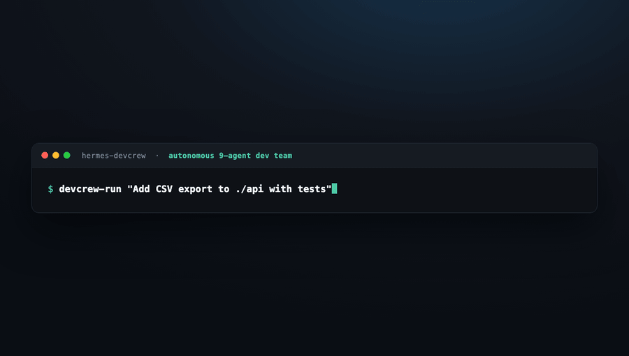
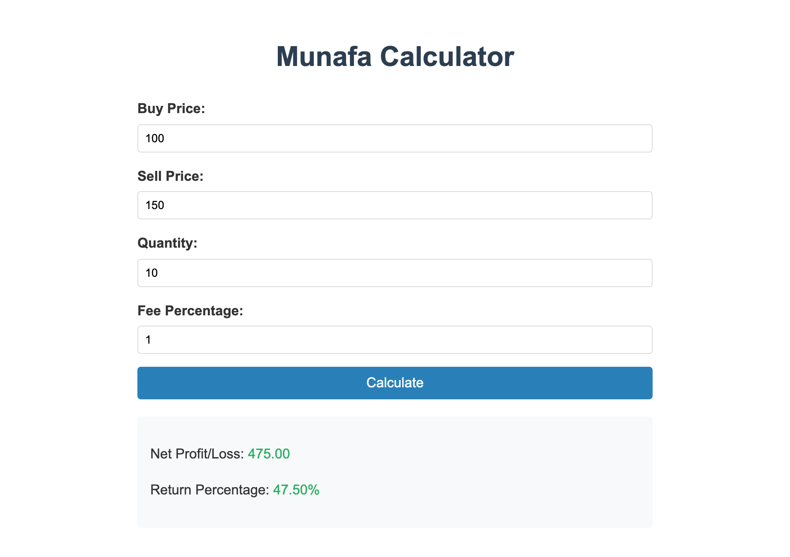

# hermes-devcrew ☤

**An autonomous, hybrid software-engineering team you install in one command.**

<p align="center">
  
</p>

`hermes-devcrew` is a packaged team of nine domain-expert agents for the
[Hermes Agent](https://hermes-agent.nousresearch.com) platform. Give it a goal; the crew plans
it, builds it in parallel, reviews itself, and synthesizes the result — autonomously, on your
machine, against your repo, with your own API key.

It's not a framework or a fork. Each agent is a real Hermes **profile distribution**; the crew
coordinates through Hermes' built-in **kanban swarm** and **dispatcher daemon**.

---

## How it works

A "team" in Hermes is several **profiles** (isolated agents) sharing one **kanban board**:

| Team concept            | Hermes mechanism                                                    |
|-------------------------|--------------------------------------------------------------------|
| A team member           | a **profile** — isolated agent with its own persona, skills, model  |
| Their expertise         | each agent's `SOUL.md` doctrine + bundled `skills/`                 |
| The backlog             | the shared **kanban** board (`hermes kanban`)                       |
| Autopilot               | `hermes kanban daemon` — runs each task as its assigned profile     |
| Parallel → verify → ship| `hermes kanban swarm` — workers → verifier → synthesizer            |

Expertise lives in files that **travel with the distribution** (`SOUL.md`, `skills/`) — not in
memory, which stays on each user's machine. Secrets never ship: distributions only *declare* the
keys they need (`OPENROUTER_API_KEY`), and you supply your own.

---

## The roster

| Agent | Swarm role | What it does | Default model |
|-------|-----------|--------------|---------------|
| **architect** | anchor | Decomposes goals into a verifiable task graph; sets acceptance criteria | `deepseek/deepseek-v3.2` |
| **backend-dev** | worker | APIs, services, data, tests (test-first) | `mistralai/codestral-2508` |
| **frontend-dev** | worker | UI, components, state, accessibility | `mistralai/codestral-2508` |
| **devops** | worker | Containers, CI/CD, deploys, observability (reversible, least-privilege) | `mistralai/codestral-2508` |
| **reviewer** | **verifier** | Adversarial correctness + security gate before anything merges | `deepseek/deepseek-v3.2` |
| **integrator** | **synthesizer** | Merges verified work into one coherent, green deliverable | `deepseek/deepseek-v3.2` |
| **domain-expert** | worker | **Customizable** specialist that learns *your* codebase | `mistralai/codestral-2508` |
| **qa** | **dynamic verifier** | Runs the app — finds bugs w/ repro steps, benchmarks, watches deploys | `deepseek/deepseek-v3.2` |
| **designer** | UI/UX (upstream) | Owns the design system, UX, accessibility, and copy; specs for frontend-dev | `deepseek/deepseek-v3.2` |

---

## What each agent knows (bundled skills)

Every agent ships a curated, **always-available** skill toolkit — no registry needed; they
travel with the distribution (40 skills total across 9 agents):

| Agent | Skills |
|-------|--------|
| **architect** | `decompose-goal` · `write-spec` · `writing-plans` · `spike` · `subagent-driven-development` |
| **backend-dev** | `ship-backend-change` · `test-driven-development` · `systematic-debugging` · `rest-graphql-debug` · `python-debugpy` · `node-inspect-debugger` · `verification-before-completion` |
| **frontend-dev** | `ship-frontend-change` · `web-development` · `frontend-design` · `page-agent` · `verification-before-completion` |
| **devops** | `safe-change-and-deploy` · `docker-management` · `verification-before-completion` |
| **reviewer** | `adversarial-review` · `github-code-review` · `web-pentest` |
| **integrator** | `integrate-and-synthesize` · `github-pr-workflow` · `github-repo-management` |
| **domain-expert** | `onboard-to-codebase` · `codebase-research` · `code-wiki` · `codebase-inspection` |
| **qa** | `qa-testing` · `performance-benchmark` · `post-deploy-canary` · `page-agent` · `verification-before-completion` |
| **designer** | `design-system` · `design-critique` · `accessibility-review` · `ux-copy` · `frontend-design` |

Some skills are bundled/adapted from the [Hermes Agent](https://hermes-agent.nousresearch.com)
library and the [superpowers](https://github.com/obra/superpowers) project (MIT) — see
[`NOTICE`](NOTICE). Each `SKILL.md` carries its own license/attribution.

---

## See it in action

The animation above is the crew fanning a goal across the board. Here's a real artifact it produced
**end-to-end** — an accessible profit-calculator widget that `designer` specced, `frontend-dev`
built, and `qa` verified (logic + a11y + security) before `integrator` synthesized it:

<p align="center">
  
</p>

---

## Install

**Prerequisites:** [Hermes](https://hermes-agent.nousresearch.com/docs/) (`>= 0.12.0`), `git`,
and an [OpenRouter](https://openrouter.ai) API key.

```bash
# clone + install (recommended while iterating)
git clone https://github.com/must-mohsin1/hermes-devcrew
cd hermes-devcrew
./install.sh

# or, once published, one line:
curl -fsSL https://raw.githubusercontent.com/must-mohsin1/hermes-devcrew/main/install.sh | bash
```

The installer is idempotent. Useful flags / env:

| Flag / env | Effect |
|---|---|
| `--daemon` | start the autonomous dispatcher immediately |
| `--with-skill-packs` | also install standard Hermes skill packs per role (needs network) |
| `OPENROUTER_API_KEY=…` | pre-supply the key (no prompt) |
| `DEVCREW_SKIP_KEYS=1` | install without writing any key |
| `DEVCREW_BOARD=myproj` | name the kanban board |

---

## Drive the crew

**One command** — the architect decomposes your goal onto the board, the dispatcher runs it, the
reviewer gates each task, the integrator synthesizes:

```bash
devcrew-run "Add OAuth login to the API with tests" /path/to/repo
hermes kanban tail        # watch the crew work
```

Flags: `--swarm` (fixed parallel fan-out across all workers), `--no-daemon` (stage tasks only),
`--interval N` (dispatcher tick). `devcrew-run` is linked into `~/.local/bin` on install; otherwise
run `./devcrew-run` from the repo.

<details><summary>Manual / advanced control</summary>

```bash
# explicit swarm graph: workers in parallel → reviewer verifies → integrator synthesizes
hermes kanban swarm "<goal>" --created-by devcrew-architect \
  --worker devcrew-backend-dev:"<task>" --worker devcrew-frontend-dev:"<task>" \
  --verifier devcrew-reviewer --synthesizer devcrew-integrator
hermes kanban daemon --verbose --interval 30    # autonomous dispatch
hermes kanban ls ; hermes kanban tail           # inspect / follow
```
</details>

### Orchestration

The **kanban dispatcher** (`hermes kanban daemon`) is the runtime orchestrator: it promotes ready
tasks, spawns each as its assigned profile in an isolated workspace, enforces dependencies, and
auto-blocks after repeated failures (`--failure-limit`). The **architect** decomposes goals;
auto-routing uses each profile's **description** (set at install). The topology — anchor → workers
→ verifier → synthesizer — lives in [`team.yaml`](team.yaml) and is mirrored by `devcrew-run`.

See [`docs/usage.md`](docs/usage.md) for manual task assignment, monitoring, cron routines, and
per-agent model overrides.

---

## Make it *your* expert

The **domain-expert** is a template. After install, teach it your project:

```bash
hermes --profile devcrew-domain-expert -z "Onboard to /path/to/my/repo"   # it fills its own context
# or edit ~/.hermes/profiles/devcrew-domain-expert/SOUL.md  → the "PROJECT CONTEXT" block
```

That block is loaded every turn, so the more you put there (stack, invariants, glossary,
gotchas), the more expert the whole crew becomes about your codebase.

---

## Models & cost

One `OPENROUTER_API_KEY` powers everyone. Defaults favor cheap-but-strong open models
(DeepSeek for reasoning roles, Codestral for coders). Swap any agent's model anytime:

```bash
hermes --profile devcrew-reviewer model     # pick interactively
```

`config.yaml` is preserved across `hermes profile update`, so your model choices survive updates.

---

## Safety & guardrails

- **`--yolo` is off by default.** Destructive/networked actions are not auto-approved.
- Workers run in **isolated workspaces**; nothing is merged until the **reviewer** passes it.
- **devops** treats destructive/prod actions as hard stops requiring human approval.
- The board keeps an auditable event stream — `hermes kanban tail` / `log`.
- Review the trust model before pointing the daemon at anything important.

## Update / uninstall

```bash
hermes profile update devcrew-architect      # re-pull doctrine/skills; keeps your memory + keys
hermes profile delete devcrew-architect      # remove one agent
```

## License

MIT — see [LICENSE](LICENSE).
